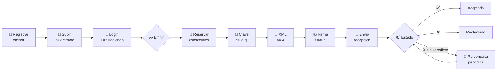

<div align="center">

# 🧾 Factu

### API de facturación electrónica para el Ministerio de Hacienda de Costa Rica

Emite comprobantes electrónicos **v4.4** de punta a punta — desde la clave hasta la firma XAdES y el envío a Hacienda — con un stack moderno en **TypeScript + Node**.

<br/>


</div>

---

## ✨ Características

| | |
|---|---|
| 📄 **7 tipos de comprobante** | Factura, Tiquete, Nota de Crédito, Nota de Débito, Factura de Compra, Factura de Exportación y **Recibo Electrónico de Pago** (REP, nuevo en v4.4) — más el Mensaje Receptor. |
| 🔢 **Consecutivos del servidor** | Contador atómico por emisor/sucursal/terminal/tipo. Dos emisiones simultáneas nunca repiten número, y el que no llega a Hacienda se devuelve a la serie. |
| 🧮 **Clave y consecutivo** | Genera la clave numérica de 50 dígitos y el consecutivo de 20. |
| 👥 **Multi-tenant + roles** | Organizaciones aisladas, multiusuario y roles (admin / facturador / lector) con JWT, OAuth (Google/Microsoft) y API keys. |
| 🎫 **Sesión Hacienda** | OAuth contra el IDP de Hacienda, con **renovación automática** de tokens, persistidos y cifrados. |
| ✍️ **Firma XAdES** | Firma enveloped **XAdES-BES / EPES** con el certificado `.p12` del emisor. |
| 📤 **Envío y estado** | Envía a recepción y consulta el estado con *polling* (`aceptado`/`rechazado`), con **re-consulta periódica** de los que Hacienda dejó sin veredicto. |
| 📬 **Entrega al cliente** | Correo automático con PDF + XML tras la aceptación, con reintentos, historial y reenvío. |
| 📥 **Documentos recibidos** | Buzón IMAP o carga manual → generación **y envío** del Mensaje Receptor. |
| 🔌 **Integraciones** | Webhooks firmados con HMAC + notificaciones (SMS, WhatsApp, Slack, Teams, Bitrix24). |
| 🛡️ **Secretos cifrados** | `.p12`, tokens del IDP y credenciales SMTP/IMAP **cifrados en reposo** (AES-256-GCM). |
| 🔒 **Endurecido** | helmet, rate limit (10/min en login), sesión en cookie `httpOnly`, chequeo de `Origin` (CSRF) y `/docs` apagadas en producción. |
| ✅ **Validación previa** | Reglas de negocio que fallan *antes* de contactar a Hacienda. |
| 📚 **Docs interactivas** | Swagger/OpenAPI en `/docs` + guías en [`docs/`](./docs/README.md). |
| 🐳 **Docker listo** | `docker compose up` levanta API + PostgreSQL en la laptop. |

---

## 🔄 El flujo de emisión



---

## 🚀 Inicio rápido

<table>
<tr>
<td width="50%" valign="top">

### 💻 Local (sin base de datos)

```bash
npm install
cp .env.example .env
npm run dev
```

Persistencia **en memoria** por defecto.

</td>
<td width="50%" valign="top">

### 🐳 Docker (API + PostgreSQL)

```bash
docker compose up --build
```

Inicializa la base y arranca todo.

</td>
</tr>
</table>

> 🏠 **Inicio:** http://localhost:3000 &nbsp;·&nbsp; 📖 **Docs (Scalar):** http://localhost:3000/docs &nbsp;·&nbsp; 🧪 **Swagger:** http://localhost:3000/swagger

---

## ⚡ Ejemplo en 4 pasos

```bash
# 0️⃣  Crear organización + usuario admin  →  devuelve un JWT
TOKEN=$(curl -s -X POST http://localhost:3000/auth/registro \
  -H "Content-Type: application/json" \
  -d '{ "tenantNombre": "Mi Empresa", "email": "admin@miempresa.cr", "nombre": "Admin", "password": "unaClaveSegura" }' \
  | node -e "process.stdin.on('data',d=>console.log(JSON.parse(d).token))")

# 1️⃣  Registrar emisor + subir su certificado  (Authorization: Bearer $TOKEN)
curl -X POST http://localhost:3000/emisor \
  -H "Authorization: Bearer $TOKEN" -H "Content-Type: application/json" \
  -d '{ "cedula": "3101123456", "nombre": "Empresa X S.A." }'

curl -X POST http://localhost:3000/emisor/3101123456/certificado \
  -H "Authorization: Bearer $TOKEN" -H "Content-Type: application/json" \
  -d '{ "p12Base64": "<.p12 en base64>", "password": "<PIN>" }'

# 2️⃣  Autenticar el emisor contra el IDP de Hacienda
curl -X POST http://localhost:3000/hacienda/login \
  -H "Authorization: Bearer $TOKEN" -H "Content-Type: application/json" \
  -d '{ "emisor": "3101123456", "username": "<usuario>", "password": "<clave>" }'

# 3️⃣  Emitir  (factura | tiquete | nota-credito | nota-debito | compra | exportacion)
#     El consecutivo es OPCIONAL: si se omite, lo reserva la API.
curl -X POST http://localhost:3000/comprobante/factura/enviar \
  -H "Authorization: Bearer $TOKEN" -H "Content-Type: application/json" \
  -d '{ "cedulaEmisor": "3101123456", "codigoActividadEmisor": "8549.0",
        "emisor": { "nombre": "Empresa X S.A.", "identificacion": { "tipo": "02", "numero": "3101123456" },
          "ubicacion": { "provincia": "1", "canton": "01", "distrito": "01", "otrasSenas": "Centro" },
          "correoElectronico": "facturas@empresa.cr" },
        "receptor": { "nombre": "Cliente Y", "identificacion": { "tipo": "01", "numero": "102340567" } },
        "lineas": [ { "codigoCabys": "8399000000000", "cantidad": 1, "unidadMedida": "Unid",
          "detalle": "Producto A", "precioUnitario": 1000,
          "impuestos": [{ "codigo": "01", "codigoTarifa": "08", "tarifa": 13 }] } ] }'
```

<div align="right"><sub>Flujo completo (notas, recibo de pago, mensaje receptor, validación) → <a href="./docs/conexion-hacienda.md">guía de conexión</a></sub></div>

---

## 🌐 Endpoints

<table>
<tr><th>Grupo</th><th>Endpoint</th><th>Descripción</th></tr>
<tr><td rowspan="3">🔐 Autenticación</td><td><code>POST /auth/registro · /auth/login</code></td><td>Crea organización + admin, o inicia sesión → JWT</td></tr>
<tr><td><code>GET /auth/oauth/:provider/url</code></td><td>Login con Google / Microsoft</td></tr>
<tr><td><code>GET·POST /auth/usuarios</code></td><td>Gestión de usuarios (admin)</td></tr>
<tr><td rowspan="2">🎫 Hacienda</td><td><code>POST /hacienda/login</code></td><td>Sesión IDP del emisor (cachea tokens)</td></tr>
<tr><td><code>POST /hacienda/token · /logout</code></td><td>Token / cierre de sesión</td></tr>
<tr><td rowspan="3">🏢 Emisores</td><td><code>GET·POST /emisor</code></td><td>Lista / registra emisores del tenant</td></tr>
<tr><td><code>POST /emisor/:cedula/certificado</code></td><td>Sube el <code>.p12</code> (cifrado)</td></tr>
<tr><td><code>GET /clientes</code></td><td>Receptores guardados (autocompletar)</td></tr>
<tr><td rowspan="6">📄 Comprobantes</td><td><code>POST /comprobante/:tipo/enviar</code></td><td>Emite de punta a punta</td></tr>
<tr><td><code>POST /recibo-pago/enviar</code></td><td>Recibo Electrónico de Pago (REP)</td></tr>
<tr><td><code>GET /comprobante/proximo-consecutivo</code></td><td>Próximo número, sin consumirlo</td></tr>
<tr><td><code>GET /comprobantes · /comprobante/:clave</code></td><td>Listado paginado y consulta</td></tr>
<tr><td><code>POST /comprobante/:clave/reenviar</code></td><td>Reenvía el correo al cliente</td></tr>
<tr><td><code>POST /factura/xml</code></td><td>Genera el XML (sin firmar)</td></tr>
<tr><td rowspan="2">📥 Recibidos</td><td><code>GET·POST /recibidos</code></td><td>Comprobantes que recibió la empresa</td></tr>
<tr><td><code>POST /recibidos/:id/mensaje-receptor[/enviar]</code></td><td>Genera y envía la aceptación / rechazo</td></tr>
<tr><td rowspan="2">📊 Estadísticas</td><td><code>GET /estadisticas/resumen · /montos</code></td><td>Totales y montos por moneda y mes</td></tr>
<tr><td><code>GET /estadisticas/emisores · /serie</code></td><td>Desglose por emisor y serie temporal</td></tr>
<tr><td rowspan="3">🔌 Integraciones</td><td><code>GET·POST /api-keys</code></td><td>Credenciales para tu ERP</td></tr>
<tr><td><code>GET·POST /webhooks</code></td><td>Avisos HTTP firmados con HMAC</td></tr>
<tr><td><code>GET·POST /notification-channels</code></td><td>SMS, WhatsApp, Slack, Teams, Bitrix24</td></tr>
</table>

> 🔒 Todos los endpoints (salvo `/`, `/health`, `/auth/registro` y `/auth/login`) requieren
> `Authorization: Bearer <JWT>`, una API key (`Bearer factu_…`) o la cookie de sesión.
> Roles: **admin** · **facturador** · **lector**.

<div align="right"><sub>Referencia completa e interactiva en <a href="http://localhost:3000/docs"><code>/docs</code></a> (Scalar / Swagger)</sub></div>

---

## 🏗️ Arquitectura

```
src/
├── config/        ⚙️  Variables de entorno tipadas (zod) + ambiente de Hacienda
├── domain/        🧠  Lógica de negocio pura (sin infraestructura)
│   ├── clave/          Clave numérica y consecutivo
│   ├── factura/        Modelo, totales y generador de XML v4.4
│   ├── reciboPago/     XML del Recibo Electrónico de Pago (REP)
│   ├── mensajeReceptor/ XML de Mensaje Receptor
│   ├── validacion/     Reglas de negocio previas al envío
│   └── auth/           Roles, permisos y errores del IDP
├── services/      🔌  Casos de uso e integraciones
│   ├── auth/           IDP de Hacienda + gestor de tokens (cifrados)
│   ├── firma/          Certificados .p12 + firma XAdES
│   ├── hacienda/       Sobre, recepción, estado y re-consulta
│   ├── entrega/        PDF + correo al cliente, con reintentos
│   └── webhooks/, notificaciones/, estadisticas/, auditoria/ …
├── infra/         🗄️  crypto/ (cifrado) · repos/ (memoria + Prisma)
├── plugins/       🛡️  Seguridad, rate limit, auth (JWT/cookie/API key), Swagger
├── routes/        🌐  Endpoints HTTP (Fastify)
└── main.ts        ▶️  Entrypoint + 5 pollers en segundo plano
```

<sub>El dominio no depende de nada externo → 100 % testeable. Los servicios inyectan sus dependencias → el flujo completo se prueba sin red ni certificados reales.</sub>

---

## 🧰 Stack

<div align="center">

| Capa | Herramienta |
|---|---|
| Runtime | **Node ≥ 20** · TypeScript (ESM, estricto) |
| HTTP | **Fastify 5** · `@fastify/swagger` |
| Persistencia | **Prisma** + PostgreSQL · o backend en memoria |
| XML | **xmlbuilder2** · `@xmldom/xmldom` · xpath |
| Firma | **xadesjs** · **node-forge** (certificados `.p12`) |
| Validación | **zod** + validación de dominio |
| Auth | **@fastify/jwt** · **@fastify/cookie** · scrypt (multi-tenant + roles) |
| Seguridad | **@fastify/helmet** · **@fastify/rate-limit** |
| Correo / PDF | **nodemailer** · **imapflow** · **pdfkit** |
| Docs | **Scalar** · **Swagger UI** · OpenAPI |
| Tests | **Vitest** (209 tests) |

</div>

---

## 📖 Documentación

| Guía | Contenido |
|---|---|
| 🚦 [Primeros pasos](./docs/primeros-pasos.md) | Instalar, configurar y levantar. |
| 🔗 [**Conexión con Hacienda**](./docs/conexion-hacienda.md) | El flujo completo, paso a paso. |
| ⚙️ [Configuración](./docs/configuracion.md) | Variables de entorno. |
| 🌐 [Referencia de la API](./docs/api.md) | Endpoints y Swagger. |
| 🐳 [Despliegue](./docs/despliegue.md) | Docker y notas de producción. |

Documentación viva del repositorio: [PROJECT_MAP.md](./PROJECT_MAP.md) ·
[REQUIREMENTS.md](./REQUIREMENTS.md) · [DOCUMENTATION.md](./DOCUMENTATION.md)

---

## 🗺️ Roadmap

- [x] **1.** Clave numérica (50 díg.) + consecutivo
- [x] **2.** Autenticación OAuth + renovación de tokens
- [x] **3.** Generación de XML v4.4 (modelo, totales, desglose)
- [x] **4.** Firma XAdES enveloped verificable
- [x] **5.** Envío a recepción + estado con *polling* y re-consulta
- [x] **6.** Todos los documentos (Factura, Tiquete, Notas, Compra, Exportación, REP, Mensaje Receptor)
- [x] **7.** Persistencia (memoria + Prisma) + secretos cifrados en reposo
- [x] **8.** Validación de negocio + XAdES-EPES configurado
- [x] **9.** Scalar + Swagger, documentación, GitHub Actions y Docker
- [x] **10.** Control de acceso: multi-tenant, usuarios, roles, API keys
- [x] **11.** Entrega al cliente, documentos recibidos, webhooks y notificaciones
- [x] **12.** Consecutivos gestionados por el servidor (contador atómico por serie)
- [x] **13.** Endurecimiento: helmet, rate limit, cookie `httpOnly`, CSRF, docs off en prod

### 🔜 Pendiente para producción

> - 🌐 **Prueba end-to-end contra el sandbox real** de Hacienda (credenciales + certificado reales)
> - 📐 Validación contra el **XSD oficial** v4.4
> - 🔑 Confirmar que la **política de firma** configurada sigue siendo la resolución vigente

---

## 🧪 Scripts

```bash
npm run dev          # 🔥 desarrollo con recarga
npm test             # ✅ suite de tests
npm run typecheck    # 🔎 chequeo de tipos
npm run build        # 📦 compila a dist/
npm start            # ▶️  ejecuta la versión compilada
```

Mantenimiento puntual:

```bash
LLAVE_VIEJA=… LLAVE_NUEVA=… node scripts/rotar-llave-maestra.mjs   # rotar FACTU_MASTER_KEY
node scripts/rellenar-totales.mjs --dry-run                        # backfill de total/moneda
```

---

<div align="center">

> ⚠️ Prueba **siempre** contra el ambiente de sandbox/`stag` antes de producción.
> Nunca subas certificados `.p12`, llaves ni PINs al repositorio.

<sub>Inspirado en <a href="https://github.com/CRLibre/API_Hacienda">CRLibre/API_Hacienda</a> (PHP) · Licencia <b>AGPL v3</b></sub>

</div>
