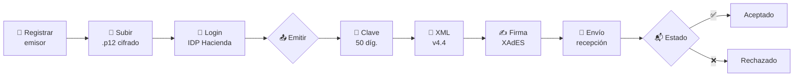

<div align="center">

# 🧾 Factu

### API de facturación electrónica para el Ministerio de Hacienda de Costa Rica

Emite comprobantes electrónicos **v4.4** de punta a punta — desde la clave hasta la firma XAdES y el envío a Hacienda — con un stack moderno en **TypeScript + Node**.

<br/>


</div>

---

## ✨ Características

| | |
|---|---|
| 🧮 **Clave y consecutivo** | Genera la clave numérica de 50 dígitos y el consecutivo de 20. |
| 🔐 **Autenticación** | OAuth contra el IDP de Hacienda, con **renovación automática** de tokens. |
| 📄 **5 tipos de comprobante** | Factura, Tiquete, Nota de Crédito, Nota de Débito y Mensaje Receptor. |
| ✍️ **Firma XAdES** | Firma enveloped **XAdES-BES / EPES** con el certificado `.p12` del emisor. |
| 📤 **Envío y estado** | Envía a recepción y consulta el estado con *polling* (`aceptado`/`rechazado`). |
| 🛡️ **Certificados cifrados** | El `.p12` se guarda **cifrado en reposo** (AES-256-GCM). |
| ✅ **Validación previa** | Reglas de negocio que fallan *antes* de contactar a Hacienda. |
| 📚 **Docs interactivas** | Swagger/OpenAPI en `/docs` + guías en [`docs/`](./docs/README.md). |
| 🐳 **Docker listo** | `docker compose up` levanta API + PostgreSQL en la laptop. |

---

## 🔄 El flujo de emisión



---

## 🚀 Inicio rápido

<table>
<tr>
<td width="50%" valign="top">

### 💻 Local (sin base de datos)

```bash
npm install
cp .env.example .env
npm run dev
```

Persistencia **en memoria** por defecto.

</td>
<td width="50%" valign="top">

### 🐳 Docker (API + PostgreSQL)

```bash
docker compose up --build
```

Inicializa la base y arranca todo.

</td>
</tr>
</table>

> 🌐 **API:** http://localhost:3000 &nbsp;·&nbsp; 📖 **Documentación interactiva:** http://localhost:3000/docs

---

## ⚡ Ejemplo en 3 pasos

```bash
# 1️⃣  Registrar emisor + subir su certificado
curl -X POST http://localhost:3000/emisor \
  -H "Content-Type: application/json" \
  -d '{ "cedula": "3101123456", "nombre": "Empresa X S.A." }'

curl -X POST http://localhost:3000/emisor/3101123456/certificado \
  -H "Content-Type: application/json" \
  -d '{ "p12Base64": "<.p12 en base64>", "password": "<PIN>" }'

# 2️⃣  Autenticar contra el IDP de Hacienda
curl -X POST http://localhost:3000/auth/login \
  -H "Content-Type: application/json" \
  -d '{ "emisor": "3101123456", "username": "<usuario>", "password": "<clave>" }'

# 3️⃣  Emitir  (factura | tiquete | nota-credito | nota-debito)
curl -X POST http://localhost:3000/comprobante/factura/enviar \
  -H "Content-Type: application/json" \
  -d '{ "cedulaEmisor": "3101123456", "consecutivo": 1, "codigoActividadEmisor": "620100",
        "emisor": { "nombre": "Empresa X S.A.", "identificacion": { "tipo": "02", "numero": "3101123456" },
          "ubicacion": { "provincia": "1", "canton": "01", "distrito": "01", "otrasSenas": "Centro" },
          "correoElectronico": "facturas@empresa.cr" },
        "receptor": { "nombre": "Cliente Y", "identificacion": { "tipo": "01", "numero": "102340567" } },
        "lineas": [ { "codigoCabys": "8399000000000", "cantidad": 1, "unidadMedida": "Unid",
          "detalle": "Producto A", "precioUnitario": 1000,
          "impuestos": [{ "codigo": "01", "codigoTarifa": "08", "tarifa": 13 }] } ] }'
```

<div align="right"><sub>Flujo completo (notas, mensaje receptor, validación) → <a href="./docs/conexion-hacienda.md">guía de conexión</a></sub></div>

---

## 🌐 Endpoints

<table>
<tr><th>Grupo</th><th>Endpoint</th><th>Descripción</th></tr>
<tr><td rowspan="2">🛠️ Utilidades</td><td><code>GET /health</code></td><td>Estado del servicio</td></tr>
<tr><td><code>POST /clave</code></td><td>Genera la clave de 50 dígitos</td></tr>
<tr><td rowspan="3">🔐 Auth</td><td><code>POST /auth/login</code></td><td>Login en el IDP (cachea tokens)</td></tr>
<tr><td><code>POST /auth/token</code></td><td>Access token válido (renueva)</td></tr>
<tr><td><code>POST /auth/logout</code></td><td>Cierra sesión</td></tr>
<tr><td rowspan="2">🏢 Emisores</td><td><code>POST /emisor</code></td><td>Registra / actualiza un emisor</td></tr>
<tr><td><code>POST /emisor/:cedula/certificado</code></td><td>Sube el <code>.p12</code> (cifrado)</td></tr>
<tr><td rowspan="4">📄 Comprobantes</td><td><code>POST /comprobante/:tipo/enviar</code></td><td>Emite de punta a punta</td></tr>
<tr><td><code>GET /comprobante/:clave</code></td><td>Consulta un comprobante</td></tr>
<tr><td><code>POST /factura/xml</code></td><td>Genera el XML (sin firmar)</td></tr>
<tr><td><code>POST /mensaje-receptor/xml</code></td><td>Aceptación / rechazo recibido</td></tr>
</table>

<div align="right"><sub>Referencia completa e interactiva en <a href="http://localhost:3000/docs"><code>/docs</code></a> (Swagger)</sub></div>

---

## 🏗️ Arquitectura

```
src/
├── config/        ⚙️  Variables de entorno tipadas (zod)
├── domain/        🧠  Lógica de negocio pura (sin infraestructura)
│   ├── clave/          Clave numérica y consecutivo
│   ├── factura/        Modelo, totales y generador de XML v4.4
│   ├── mensajeReceptor/ XML de Mensaje Receptor
│   └── validacion/     Reglas de negocio previas al envío
├── services/      🔌  Casos de uso e integraciones
│   ├── auth/           IDP de Hacienda + gestor de tokens
│   ├── firma/          Certificados .p12 + firma XAdES
│   ├── hacienda/       Recepción + orquestador de emisión
│   └── emisor/         Almacén de certificados cifrados
├── infra/         🗄️  crypto/ (cifrado) · repos/ (memoria + Prisma)
├── plugins/       📚  Swagger / esquemas OpenAPI
├── routes/        🌐  Endpoints HTTP (Fastify)
└── main.ts        ▶️  Entrypoint
```

<sub>El dominio no depende de nada externo → 100 % testeable. Los servicios inyectan sus dependencias → el flujo completo se prueba sin red ni certificados reales.</sub>

---

## 🧰 Stack

<div align="center">

| Capa | Herramienta |
|---|---|
| Runtime | **Node ≥ 20** · TypeScript (ESM, estricto) |
| HTTP | **Fastify 5** · `@fastify/swagger` |
| Persistencia | **Prisma** + PostgreSQL · o backend en memoria |
| XML | **xmlbuilder2** |
| Firma | **xadesjs** · **node-forge** (certificados `.p12`) |
| Validación | **zod** + validación de dominio |
| Tests | **Vitest** (86 tests) |

</div>

---

## 📖 Documentación

| Guía | Contenido |
|---|---|
| 🚦 [Primeros pasos](./docs/primeros-pasos.md) | Instalar, configurar y levantar. |
| 🔗 [**Conexión con Hacienda**](./docs/conexion-hacienda.md) | El flujo completo, paso a paso. |
| ⚙️ [Configuración](./docs/configuracion.md) | Variables de entorno. |
| 🌐 [Referencia de la API](./docs/api.md) | Endpoints y Swagger. |
| 🐳 [Despliegue](./docs/despliegue.md) | Docker y notas de producción. |

---

## 🗺️ Roadmap

- [x] **1.** Clave numérica (50 díg.) + consecutivo
- [x] **2.** Autenticación OAuth + renovación de tokens
- [x] **3.** Generación de XML v4.4 (modelo, totales, desglose)
- [x] **4.** Firma XAdES enveloped verificable
- [x] **5.** Envío a recepción + estado con *polling*
- [x] **6.** Todos los documentos (Factura, Tiquete, Notas, Mensaje Receptor)
- [x] **7.** Persistencia (memoria + Prisma) + certificados cifrados
- [x] **8.** Validación de negocio + XAdES-EPES configurable
- [x] **9.** Swagger, documentación, GitHub Actions y Docker

### 🔜 Pendiente para producción

> - 🔑 Datos oficiales de la **política de firma** (`HACIENDA_POLICY_URL` + `HACIENDA_POLICY_HASH`) para XAdES-EPES
> - 📐 Validación contra el **XSD oficial** v4.4
> - 🌐 **URLs oficiales** del IDP/recepción y pruebas contra el sandbox real
> - 👥 Para exponerlo a **varios clientes**: capa de autenticación de la API y gestión de consecutivos

---

## 🧪 Scripts

```bash
npm run dev          # 🔥 desarrollo con recarga
npm test             # ✅ suite de tests
npm run typecheck    # 🔎 chequeo de tipos
npm run build        # 📦 compila a dist/
npm start            # ▶️  ejecuta la versión compilada
```

---

<div align="center">

> ⚠️ Prueba **siempre** contra el ambiente de sandbox/`stag` antes de producción.
> Nunca subas certificados `.p12`, llaves ni PINs al repositorio.

<sub>Inspirado en <a href="https://github.com/CRLibre/API_Hacienda">CRLibre/API_Hacienda</a> (PHP) · Licencia <b>AGPL v3</b></sub>

</div>
